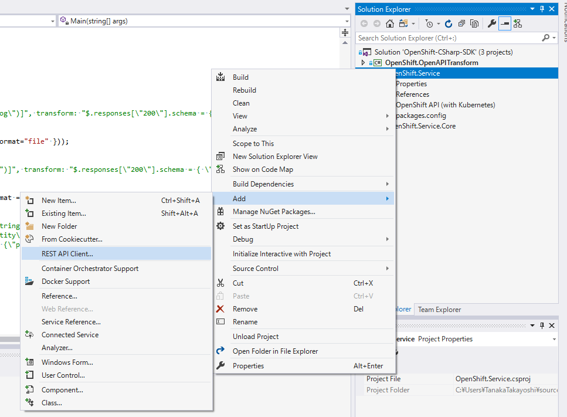
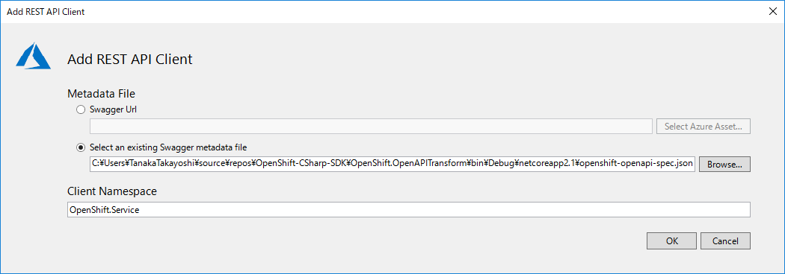
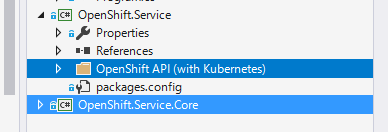

# OpenShift REST client library for C#

## How to generate code

1. Run OpenShift.OpenAPITransform project to generate the hot-fixed OpenAPI specification document.
2. Create .NET Framework Class Library Project with Visual Studio.
3. Add `REST API Client` in the project context menu.
  
4. Specify the json file path generated by step 1.
  
5. (optional) If you want this clinet library as a .NET Core, create a placehoolder .NET Core project and copy the folder to .NET Core project.
  

## How to use

1. Add the generated proejct reference to your project.
2. Add `Microsoft.Rest.ClientRuntim` package reference to your projct.
3. Write a code!

```csharp
//if your master URL has an invalid SSL
var handler = new HttpClientHandler
{
    ServerCertificateCustomValidationCallback = HttpClientHandler.DangerousAcceptAnyServerCertificateValidator
};
var client = new OpenShiftAPIwithKubernetes(new Uri("https://<master_host>:8443/"), new TokenCredentials("<token>"), handler);
var pods = await client.ListCoreV1NamespacedPodAsync("development");
foreach (var pod in pods.Items)
{
    Console.WriteLine(pod.Metadata.Name + "=" + pod.Status.Phase);
}
```